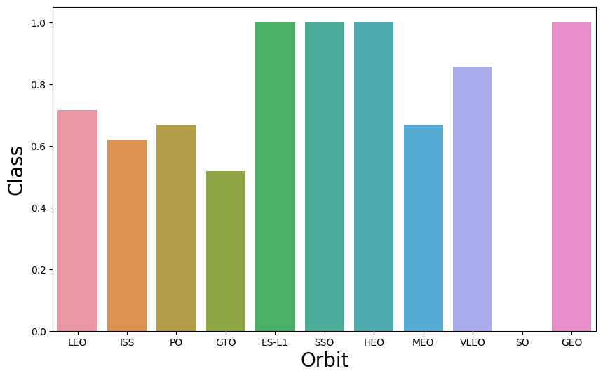

# Winning Space Race with Data Science


# Executive Summary

## Summary of Methodologies

This project applied a structured data science approach to analyze SpaceX’s launch data:

1.	Data Collection:
	* Utilized the SpaceX REST API to fetch launch data, including supplementary information on rockets, payloads, and launchpads.
	* Complemented the dataset with web scraping from Wikipedia pages to retrieve detailed Falcon 9 launch records.
2.	Data Wrangling:
	* Filtered out Falcon 1 launches to focus solely on Falcon 9.
	* Addressed missing values, replacing them with appropriate statistics such as column means.
3.	Exploratory Data Analysis (EDA):
	* Conducted visual analysis using bar charts, scatter plots, and pie charts to uncover trends and relationships.
	* Executed SQL queries to derive insights on launch site performance, payload distribution, and mission outcomes.
4.	Interactive Visual Analytics:
	* Created interactive maps using Folium to visualize launch sites and outcomes.
	* Built dynamic dashboards with Plotly Dash, enabling users to explore data by payload, launch site, and success rates.
5.	Predictive Modeling:
	* Developed classification models (Logistic Regression, Decision Trees, etc.) to predict landing outcomes.
	* Used GridSearchCV for hyperparameter tuning and cross-validation for model evaluation.

## Summary of Results

1.	Insights from Data Analysis:
	* Launch sites such as KSC LC-39A and CCAFS LC-40 emerged as pivotal in SpaceX’s operations, showing high success rates.
	* Payload mass and orbit types demonstrated significant influence on landing outcomes.
2.	Interactive Visualizations:
	* Folium maps effectively highlighted geographical patterns in launch site success.
	* Plotly Dash dashboards enabled detailed exploration of payload vs. success trends.
3.	Predictive Modeling Results:
	* Logistic Regression emerged as the best-performing model, achieving an accuracy of 83.33%.
	* Confusion matrix analysis confirmed its reliability in distinguishing successful from failed landings.
4.	Actionable Insights:
	* The findings underscore the importance of payload selection and site optimization in achieving successful launches.


# Introduction

SpaceX has been revolutionizing the space industry by reducing the cost of space exploration and improving the success rate of rocket launches. Their reusable rocket technology has set a new benchmark for innovation. This project aims to analyze SpaceX’s historical launch data to uncover patterns and insights that contribute to their success.

### Problems You Want to Find Answers For:

1.	What are the key factors influencing the success or failure of SpaceX launches?
2.	How do payload mass and orbit type impact the likelihood of successful landings?
3.	Which launch sites contribute the most to SpaceX’s success?
4.	Can we predict the success of a launch based on historical data and specific mission parameters?


# Methodology

## Methodology

1.	Data Collection:
	* REST API: Data from SpaceX endpoint api.spacexdata.com/v4/launches/past with additional data from /rockets, /payloads, and /launchpads.
	* Web Scraping: HTML tables from Falcon 9 Wiki pages cleaned and integrated into pandas dataframes.
2.	Data Wrangling:
	* Filtered out Falcon 1 launches to focus on Falcon 9.
	* Replaced missing PayloadMass values with the mean.
3.	Exploratory Data Analysis (EDA):
	* Visualized data with bar charts, pie charts, scatter plots, and SQL queries for trends and relationships.
4.	Interactive Visual Analytics:
	* Folium: Interactive maps with launch site markers, radii, and trajectories.
	* Plotly Dash: Dashboard for filtering by launch sites, payload mass, and visualizing success rates.
5.	Predictive Analysis:
	* Built classification models to predict landing outcomes.
	* Tuned models using GridSearchCV and evaluated with accuracy and F1-score.
6.	Model Selection:
	* Compared models via cross-validation.
	* Visualized accuracy and selected the best-performing model using confusion matrix analysis.

## Data Collection

Describe how data sets were collected:

1. SpaceX REST API:
	* Endpoint: [api.spacexdata.com](https://api.spacexdata.com/v4/launches/past)
	* This endpoint provided structured data about past SpaceX launches, including details about rockets, payloads, launchpads, and more. The data was retrieved in JSON format.
	* Supplementary data was gathered by querying additional API endpoints (e.g., /rockets, /launchpads, /payloads) to enrich and clarify key fields.
2. Web Scraping:
	* HTML tables containing Falcon 9 launch data were extracted from relevant Wiki pages using Python’s BeautifulSoup library.
	* These tables were parsed, cleaned, and converted into pandas dataframes for integration with the API data.


### Flowchart

1. Start
1. Fetch Launch Data from API (Get Request)
1. Parse JSON Response
1. Normalize JSON Data to Flat Table (pandas)
1. Supplement Data:
1. Clean & Transform Data:
1. Merge API and Web Scraped Data
1. Store Cleaned Dataset for Analysis
1. End

### Key Phrases

1.	REST API Access:
	* “Data was retrieved using requests library with a GET method to the endpoint api.spacexdata.com/v4/launches/past.”
	* “Supplementary data fields (e.g., rocket, payload) were enriched using targeted API calls to /rockets, /launchpads, and /payloads.”
2.	JSON Parsing and Normalization:
	* “Structured JSON responses were flattened into a tabular format using json_normalize.”
	* “Nested attributes were extracted and converted into separate columns for easier analysis.”
3.	Web Scraping:
	* “HTML tables from Falcon 9-related Wiki pages were extracted and parsed using the BeautifulSoup library.”
	* “Raw scraped data was cleaned and converted into pandas dataframes for integration.”
4.	Data Cleaning:
	* “Irrelevant records (Falcon 1 launches) were filtered out using conditional filtering in pandas.”
	* “NULL values in the PayloadMass column were replaced with the column mean for consistency.”
5.	Data Integration:
	* “The API and scraped data were merged to form a comprehensive dataset for analysis.”
	* “Unique identifiers (e.g., rocket IDs) were used to map and link data across different sources.”


## Data Collection – SpaceX API

### Key Phrases for SpaceX REST API Calls

1.	Initiate API Calls:
	*	“Used the requests library to perform GET requests on the SpaceX REST API endpoint: https://api.spacexdata.com/v4/launches/past.”
	*	“Fetched launch data, including rocket details, payload, and launch outcomes.”
2.	Parsing API Responses:
	*	“Parsed JSON responses from the API using the json() method.”
	*	“Extracted nested data for detailed analysis (e.g., rocket IDs, payload information).”
3.	Data Normalization:
	*	“Utilized pandas.json_normalize to flatten nested JSON structures into tabular format.”
	* “Mapped IDs (e.g., rockets, payloads) to descriptive details by querying supplementary API endpoints.”
4.	Data Cleaning:
	* “Filtered data to exclude Falcon 1 launches, focusing exclusively on Falcon 9.”
	* “Handled missing values in key columns like PayloadMass by replacing them with the column’s mean.”
5.	Storing Data:
	* "Prepared a clean and structured dataset for analysis and visualization.”

### Flowchart

1. Start
1. Perform GET Request to SpaceX API
	* Endpoint: /launches/past
1. Parse JSON Response
	* Use: response.json()
1. Normalize JSON Data
	* Use: pandas.json_normalize()
1. Enrich Data by Querying Additional Endpoints
	* /rockets
	* /payloads
	* /launchpads
1. Clean Data
	* Filter Falcon 1 Launches
	* Handle Missing Values (e.g., PayloadMass)
1. Store Final Dataset
1. End

### GitHub

GitHub URL: [Notebook File](https://github.com/xsagti/IBM-Applied-Data-Science-Capstone/blob/6d38cf26b8f57d254a716bfc8feb421ff724f103/Notebooks/1-jupyter-labs-spacex-data-collection-api-v2.ipynb)

## Data Collection - Scraping


### Key Phrases for Web Scraping Process

1.	Target Data Source:
	* “The target webpage is https://en.wikipedia.org/wiki/List_of_Falcon_9_and_Falcon_Heavy_launches.”
	* “HTML tables containing launch records were identified as the main source of data.”
2.	Scraping with BeautifulSoup:
	* “The requests library was used to fetch the HTML content of the webpage.”
	* “BeautifulSoup parsed the HTML content to locate relevant \<table> elements.”
3.	Extracting Table Data:
	* “Iterated over the rows of the identified table to extract data into lists or dictionaries.”
	* “Specific columns, such as launch date, payload, and outcome, were extracted for analysis.”
4.	Data Cleaning and Transformation:
	* “Converted raw table data into a pandas dataframe for further processing.”
	* “Cleaned up missing or irrelevant values, ensuring consistency in the dataset.”
5.	Data Integration:
	* “The scraped data was integrated with data from the SpaceX API to create a comprehensive dataset.”


### Flowchart

1. Start
1. Fetch HTML Content of Wikipedia Page
	* Use: requests.get()
1. Parse HTML with BeautifulSoup
	* Use: BeautifulSoup()
1. Locate and Extract Relevant Tables
	* Target: \<table> tags
1. Transform Table Data into Pandas DataFrame
	* Use: pandas.DataFrame()
1. Clean and Process Data
	* Handle Missing Values
	* Filter Irrelevant Rows
1. Integrate with API Data
2. Store Cleaned Dataset
1. End

### GitHub

GitHub URL: [Notebook file](https://github.com/xsagti/IBM-Applied-Data-Science-Capstone/blob/6d38cf26b8f57d254a716bfc8feb421ff724f103/Notebooks/2-jupyter-labs-webscraping.ipynb)


## Data Wrangling

### Key Phrases for Data Wrangling Process

1.	Data Exploration:
	* “Explored data to identify patterns and inconsistencies.”
	* “Examined outcomes such as True Ocean, False Ocean, True RTLS, False RTLS, True ASDS, and False ASDS to understand success and failure cases.”
2.	Data Transformation:
	* “Converted landing outcomes into binary labels: 1 for successful landings and 0 for unsuccessful ones.”
	* “Extracted meaningful columns for machine learning, focusing on landing success and other significant features.”
3.	Handling Missing Data:
	* “Identified and addressed null values in critical columns, replacing them with appropriate substitutes like the mean or mode.”
4.	Feature Engineering:
	* “Created new features from existing data to enhance predictive modeling, such as categorizing outcomes or normalizing numeric columns.”
5.	Integration and Storage:
	* “Integrated cleaned and transformed data into a final dataset, ready for analysis or training supervised models.”

### Flowchart

1. Start
   |
   v
2. Load Dataset
       Use: pandas.read_csv()
   |
   v
3. Perform Exploratory Data Analysis (EDA)
       - Identify key features and missing values
       - Analyze patterns in outcomes
   |
   v
4. Transform Data
       - Convert outcomes to binary labels
       - Normalize numeric columns
   |
   v
5. Handle Missing Values
       - Replace nulls with mean, median, or mode
   |
   v
6. Feature Engineering
       - Create derived features
       - Categorize or encode key columns
   |
   v
7. Save Processed Dataset
       Use: pandas.to_csv()
   |
   v
8. End

### GitHub

GitHub URL: [Notebook File](https://github.com/xsagti/IBM-Applied-Data-Science-Capstone/blob/6d38cf26b8f57d254a716bfc8feb421ff724f103/Notebooks/3-jupyter-labs-spacex-Data%20wrangling-v2.ipynb)


## EDA with Data Visualization


### Charts Plotted and Their Purpose

1.	Bar Charts:
	* Why: To visualize categorical distributions, such as the number of successful vs. unsuccessful landings or the frequency of launch sites.
	* Example: A bar chart showing the count of launches by launch site to identify the most frequently used sites.
2.	Pie Charts:
	* Why: To display proportions, such as the percentage of launches that succeeded or failed.
	* Example: A pie chart illustrating the success rate of Falcon 9 landings.
3.	Scatter Plots:
	* Why: To analyze relationships between numerical variables, such as payload mass and landing outcome.
	* Example: A scatter plot showing payload mass versus success rate to identify trends.
4.	Histograms:
	* Why: To display distributions of continuous variables, such as payload mass.
	* Example: A histogram of payload mass to identify common payload sizes.
5.	Box Plots:
	* Why: To analyze data variability and detect outliers.
	* Example: A box plot of payload mass grouped by success or failure to understand variability in payload sizes.
6.	Line Charts:
	* Why: To observe trends over time, such as the number of successful launches per year.
	* Example: A line chart showing the trend of successful landings over time.

### GitHub

GitHub URL: [Notebook File](https://github.com/xsagti/IBM-Applied-Data-Science-Capstone/blob/6d38cf26b8f57d254a716bfc8feb421ff724f103/Notebooks/5-jupyter-labs-eda-dataviz-v2.ipynb)


## EDA with SQL


### Summary of SQL Queries

1. Data Ingestion:
	* “Loaded the SpaceX dataset into a database table using CSV import methods.”
	* “Verified successful data ingestion with SELECT COUNT(*) and table structure inspection.”
2. Basic Exploration:
	* “Queried the first few rows of the table using SELECT * FROM table_name LIMIT n.”
	* “Checked unique values for key fields like LaunchSite using SELECT DISTINCT column_name.”
3. Aggregations:
	*	“Calculated the total number of launches per launch site using GROUP BY and COUNT().”
	* “Summarized the success rate of landings with COUNT and CASE statements.”
4. Filtering and Conditions:
	* “Filtered records for specific rockets (e.g., Falcon 9) using WHERE conditions.”
	* “Queried payload data for launches exceeding a specified mass using WHERE payload_mass > value.”
5. Joins:
	* “Joined tables to enrich launch data with additional details, such as rocket or payload information.”
	* “Used INNER JOIN for integrating related datasets based on unique identifiers.”
6. Sorting:
	* “Ranked launches by payload mass using ORDER BY payload_mass DESC to identify the heaviest payloads.”

### GitHub

GitHub URL: [Notebok File](https://github.com/xsagti/IBM-Applied-Data-Science-Capstone/blob/6d38cf26b8f57d254a716bfc8feb421ff724f103/Notebooks/4-jupyter-labs-eda-sql-coursera_sqllite.ipynb)


## Build an Interactive Map with Folium


### Summary of Map Objects Added

1.	Markers:
	* Purpose:
		* Highlight specific launch site locations on the map.
		* Provide information about each launch site (e.g., name and location) through popups.
	* Why:
		* Helps visualize where each launch site is geographically located.
2.	Circles:
	* Purpose:
		* Represent the radius around each launch site to analyze proximity-related factors (e.g., population density or water bodies).
	* Why:
		* Useful for understanding spatial relationships and their potential impact on launch outcomes.
3.	Lines:
	* Purpose:
		* Draw trajectories from launch sites to target locations in orbit or highlight distances between locations.
	* Why:
		* Provides a visual representation of launch trajectories and geographic context.
4.	Layers:
	* Purpose:
		* Use additional map layers (e.g., satellite view or terrain view) to analyze geographic features.
	* Why:
		* Offers diverse perspectives for understanding environmental and geographic impacts.


### GitHub

GitHub URL: [Notebook File](https://github.com/xsagti/IBM-Applied-Data-Science-Capstone/blob/6d38cf26b8f57d254a716bfc8feb421ff724f103/Notebooks/6-jupyter-labs-launch-site-location-v2.ipynb)


## Build a Dashboard with Plotly Dash


### Plots/Graphs and Interactions

1.	Scatter Plot:
	* Purpose: Visualizes the relationship between payload mass and launch success for different launch sites.
	* Interactions:
		* Dropdown to filter data by specific launch sites or show all sites.
		* Dynamic updates based on user selection.
	* Why:
		* Helps identify patterns or correlations between payload and launch success across sites.
2.	Pie Chart:
	* Purpose: Displays the success rate of launches for selected launch sites.
	* Interactions:
		* Dropdown to select a specific launch site or view aggregated data for all sites.
	* Why:
		* Offers a clear and intuitive representation of success rates, making it easy to compare performance.
3.	Range Slider for Payload Mass:
	* Purpose: Allows users to filter data by payload mass range.
	* Interactions:
		* Adjusting the slider dynamically updates the scatter plot to reflect the selected payload range.
	* Why:
		* Enables detailed exploration of the impact of payload mass on launch success.
4.	Dynamic Layout:
	* Purpose: Organizes the dashboard with interactive components and visualizations for a seamless user experience.
	* Why:
		* Ensures that all interactions and plots are accessible and visually appealing.

### Why These Plots and Interactions Were Added

* To facilitate interactive exploration of SpaceX launch data.
* To provide insights into key performance metrics, such as payload effects and success rates.
* To make the analysis user-friendly and visually compelling through dynamic updates and customizable filters.


### GitHub

GitHub URL: [Notebook File](https://github.com/xsagti/IBM-Applied-Data-Science-Capstone/blob/6d38cf26b8f57d254a716bfc8feb421ff724f103/Notebooks/7-python-spacex_dash_app.py)


## Predictive Analysis (Classification)


### Model Development Process

1.	Data Preparation:
	* Selected key features (payload mass, orbit, launch site, booster version).
	* Encoded categorical variables (e.g., one-hot encoding).
	* Normalized numerical values for uniform scaling.
2.	Model Building:
	* Tested models: Logistic Regression, Decision Trees, SVM, KNN, and Random Forests.
3.	Model Evaluation:
	* Metrics: Accuracy, Precision, Recall, F1-Score.
	* Applied cross-validation for robustness.
4.	Hyperparameter Tuning:
	* Used GridSearchCV to optimize key parameters (e.g., C for Logistic Regression, max_depth for Decision Trees).
5.	Best Model Selection:
	* Chose the model with the highest F1-Score and cross-validation performance.
6.	Final Testing:
	* Validated on unseen test data and analyzed the confusion matrix.

### Flowchart

1. Start
   |
   v
2. Load and Preprocess Data
       - Encode categorical features
       - Normalize numerical values
   |
   v
3. Train Models
       - Logistic Regression
       - Decision Trees
       - SVM
       - KNN
       - Random Forests
   |
   v
4. Evaluate Models
       - Accuracy, Precision, Recall
       - F1-Score
       - Cross-validation
   |
   v
5. Tune Hyperparameters
       - Use GridSearchCV for optimization
   |
   v
6. Select Best Model
       - Based on evaluation metrics
   |
   v
7. Final Testing
       - Evaluate on unseen test data
       - Generate confusion matrix
   |
   v
8. End

### GitHub

GitHub URL: [Notebook File](https://github.com/xsagti/IBM-Applied-Data-Science-Capstone/blob/6d38cf26b8f57d254a716bfc8feb421ff724f103/Notebooks/8-jupyter-labs-SpaceX-Machine-Learning-Prediction-Part-5-v1.ipynb)


## Results

### Insights from EDA:
* Launch sites such as “CCAFS LC-40” were identified as key contributors to SpaceX’s success.
* A positive correlation was observed between payload mass and launch outcomes in certain orbits.

### Interactive Maps:

* Maps demonstrated the geographical distribution of launch sites and their success rates.
* Proximity analyses to infrastructure like highways and coastlines were visualized.

### Predictive Models:
* Models such as Logistic Regression and Decision Trees achieved similar accuracy (~83.33%).
* The Logistic Regression model was selected as the best performer based on F1-score and confusion matrix analysis.


# Section 2 - Insights drawn from EDA

## Flight Number vs. Launch Site


### Explanations
This scatter plot demonstrates the relationship between the flight number and the launch site. It highlights the frequency of launches from each site, revealing that CCAFS LC-40 and KSC LC-39A hosted the majority of SpaceX’s missions. This insight emphasizes the operational importance of these sites in SpaceX’s strategy.


## Payload vs. Launch Site


### Explanations
The plot illustrates the payload mass for different launches across SpaceX’s sites. It shows that heavier payloads were often launched from KSC LC-39A, suggesting that this site is better equipped for missions involving higher payload masses.


## Success Rate vs. Orbit Type



### Explanations
This bar chart showcases the success rate for different orbit types. Geostationary Transfer Orbit (GTO) has a slightly lower success rate compared to Low Earth Orbit (LEO), indicating that GTO missions are more challenging due to higher technical demands.


## Flight Number vs. Orbit Type


### Explanations
This scatter plot shows how orbit type distribution evolved as SpaceX launched more flights. Early missions targeted simpler orbits (LEO), while later flights included more complex missions to GTO and beyond.


## Payload vs. Orbit Type


### Explanations
This scatter plot analyzes how payload mass varies across orbit types. LEO missions can accommodate heavier payloads compared to GTO, reflecting differences in mission requirements and technical constraints.


## Launch Success Yearly Trend


### Explanations
The line chart depicts the yearly trend in SpaceX’s launch success rate. A consistent improvement over time is evident, showcasing the company’s learning curve and technological advancements.


## All Launch Site Names


```SQL
SELECT 
	distinct Launch_Site
FROM
	SPACEXTABLE
```


| Launch Site | Lat | Long |
|---|---|---|
| CCAFS LC-40 | 28.562302 | -80.577356 |
| CCAFS SLC-40 | 28.563197 | -80.576820 |
| KSC LC-39A | 28.573255 | -80.646895 |
| VAFB SLC-4E | 34.632834 | -120.610745 |

### Explanations
This query retrieves the unique names of all launch sites where SpaceX missions have taken place. The result shows sites such as CCAFS LC-40 and KSC LC-39A, highlighting their significance in SpaceX’s operations.

## Launch Site Names Begin with 'CCA'


```SQL
SELECT
	*
FROM 
	SPACEXTABLE 
WHERE 
	Launch_Site like 'CCA%' limit 5
```


### Explanations
This query filters launch sites whose names start with ‘CCA’, limiting the result to the first five records. It focuses on sites such as CCAFS LC-40 and CCAFS SLC-40 to analyze their operational patterns.


## Total Payload Mass


```SQL
SELECT
	SUM(PAYLOAD_MASS__KG_) as TOTAL_PAYLOAD_MASS_KG_ 
FROM 
	SPACEXTABLE 
WHERE 
	Customer = 'NASA (CRS)'
```

| TOTAL\_PAYLOAD\_MASS\_KG\_|
|----|
|45596|


### Explanations
The query calculates the total payload mass carried by boosters for NASA (CRS) missions. This provides insights into NASA’s dependency on SpaceX for delivering heavy payloads.

## Average Payload Mass by F9 v1.1


```SQL
SELECT
	AVG(PAYLOAD_MASS__KG_) as AVG_PAYLOAD_MASS_KG_ 
FROM 
	SPACEXTABLE 
WHERE 
	Booster_Version LIKE 'F9 v1.1%'

```

|AVG\_PAYLOAD\_MASS\_KG\_|
|----|
|2534.6666666666665|


### Explanations
This query computes the average payload mass for the Falcon 9 v1.1 booster version, offering insights into its operational capacity and performance.


## First Successful Ground Landing Date

```SQL
SELECT 
	Date 
FROM
	SPACEXTABLE 
WHERE 
	Landing_Outcome LIKE 'Success%' order by Date asc limit 1
```

|Date|
|----|
|2015-12-22|


### Explanations
This query identifies the date of SpaceX’s first successful ground landing. It showcases a milestone in SpaceX’s reusability goals and technological achievements.

## Successful Drone Ship Landing with Payload between 4000 and 6000


```SQL
SELECT 
	Booster_Version 
FROM 
	SPACEXTABLE 
WHERE 
	Landing_Outcome == 'Success (drone ship)' 
	AND 
	PAYLOAD_MASS__KG_ > 4000 
	AND 
	PAYLOAD_MASS__KG_ < 6000

```

| Booster_Version |
|---|---|
| F9 FT B1022 |
| F9 FT B1026 |
| F9 FT B1021.2 |
| F9 FT B1031.2 |

### Explanations
This query lists the boosters that successfully landed on a drone ship while carrying payloads between 4000 and 6000 kg. It demonstrates SpaceX’s precision in handling medium payloads.


## Total Number of Successful and Failure Mission Outcomes


```SQL
SELECT 
	Mission_Outcome, 
	COUNT(*) as Count 
FROM 
	SPACEXTABLE 
GROUP BY 
	Mission_Outcome
```

| Mission_Outcome | Count |
|---|---|
| Failure (in flight) | 1 |
| Success | 98 |
| Success | 1 |
| Success (payload status unclear) | 1  | 


### Explanations
Summarizes the count of each mission outcome (e.g., success, failure, unclear payload status).

```SQL
SELECT 
	COUNT(*) 
FROM 
	SPACEXTABLE 
WHERE 
	Landing_Outcome LIKE 'Success%' 
```


| Success COUNT (*) |
|---|
| 61 |


### Explanations
Counts the total number of successful landings across all SpaceX missions.

```SQL
SELECT 
	COUNT(*) 
FROM 
	SPACEXTABLE 
WHERE 
	Landing_Outcome LIKE 'Failure%' 
```

| Failure COUNT (*) |
|---|
| 10 |


### Explanations
Counts the total number of failed landings, highlighting areas for improvement.


```SQL
SELECT 
    COUNT(CASE WHEN Landing_Outcome LIKE 'Success%' THEN 1 END) AS SuccessCount, 
    COUNT(CASE WHEN Landing_Outcome LIKE 'Failure%' THEN 1 END) AS FailureCount 
FROM 
	SPACEXTABLE;
```

| Success | Failures |
|---|---|
| 61 | 10 |


### Explanations
Provides a direct comparison of successful and failed outcomes.


## Boosters Carried Maximum Payload


```SQL
SELECT 
	DISTINCT Booster_Version
FROM 
	SPACEXTABLE
WHERE 
	PAYLOAD_MASS__KG_ = (SELECT MAX(PAYLOAD_MASS__KG_) FROM SPACEXTABLE)
```

| Booster_Version |
|---|---|
| F9 B5 B1048.4 |
| F9 B5 B1049.4 |
| F9 B5 B1051.3 |
| F9 B5 B1056.4 |
| F9 B5 B1048.5 |
| F9 B5 B1051.4 |
| F9 B5 B1049.5 |
| F9 B5 B1060.2 |
| F9 B5 B1058.3 |
| F9 B5 B1051.6 |
| F9 B5 B1060.3 |
| F9 B5 B1049.7 |

### Explanations
This query identifies the boosters that carried the heaviest payloads, showcasing their maximum capacity and reliability.


## 2015 Launch Records


```SQL
SELECT 
	substr(Date, 6,2) as month,
    Landing_Outcome,
    Booster_Version,
    Launch_Site
FROM 
	SPACEXTABLE
WHERE 
	substr(Date,0,5)='2015'
	AND 
	Landing_Outcome like 'Failure (drone ship)'
ORDER 
	BY month;
```

| Month | Landing_Outcome | Booster_Version | Launch_Site |
|---|---|---|---|
| 01 | Failure (drone ship) | F9 v1.1 B1012 | CCAFS LC-40 |
| 04 | Failure (drone ship) | F9 v1.1 B1015 | CCAFS LC-40 |


### Explanations
This query retrieves records of failed drone ship landings in 2015, providing insights into early challenges faced by SpaceX.


## Rank Landing Outcomes Between 2010-06-04 and 2017-03-20


```SQL
SELECT
    Landing_Outcome,
    COUNT(Landing_Outcome) as Count
FROM 
	SPACEXTABLE
WHERE 
	Date BETWEEN '2010-06-04' AND '2017-03-20'
GROUP BY 
	Landing_Outcome
ORDER BY 
	Count DESC 
```

| Landing_Outcome | Count |
|---|---|
| No attempt       | 10    |
| Success (drone ship) | 5     |
| Failure (drone ship) | 5     |
| Success (ground pad) | 3     |
| Controlled (ocean) | 3     |
| Uncontrolled (ocean) | 2     |
| Failure (parachute) | 2     |
| Precluded (drone ship) | 1     | 

### Explanations
This query ranks landing outcomes during a specific timeframe, showing SpaceX’s progress and challenges over the years.


# Section 3 - Launch Sites Proximities Analysis


## Folium Map - All Launch Sites

Datasourece: spacex\_launch_geo.csv


| Launch Site | Lat      | Long      |
|-------------|---------|---------|
| CCAFS LC-40  | 28.562302 | -80.577356 |
| CCAFS SLC-40 | 28.563197 | -80.576820 |
| KSC LC-39A   | 28.573255 | -80.646895 |
| VAFB SLC-4E  | 34.632834 | -120.610745 |


### Explanations
This interactive map marks all SpaceX launch sites. Key locations such as CCAFS LC-40 and KSC LC-39A are highlighted, providing a geographical overview of their strategic positions near the coastline.


## Folium Map - Success/Failed launches for site 


### Explanations
The color-coded markers indicate the success or failure of launches from each site. The clustering of successful launches around KSC LC-39A reflects its reliability and advanced infrastructure.


## Folium Map - Distance from launch site to proximities


### Explanations
This map visualizes the distances between launch sites and nearby infrastructure such as highways, railways, and coastlines. The proximity analysis aids in understanding logistical and safety considerations for site selection.


# Section 4 - Build a Dashboard with Plotly Dash


## Dashboard Screenshot 1


### Explanations
The pie chart displays the success rate of launches across all sites. KSC LC-39A leads in successful launches, emphasizing its pivotal role in SpaceX’s operations.

## Dashboard Screenshot 2


### Explanations
This pie chart focuses on the launch site with the highest success ratio. It confirms that KSC LC-39A has the most efficient setup, achieving consistent success over multiple launches.

## Dashboard Screenshot 3


### Explanations
The scatter plot shows the relationship between payload mass and launch outcome for all sites. Higher payloads correlate with a slightly reduced success rate, particularly for complex missions to GTO.

# Section 5 - Predictive Analysis (Classification)

## Classification Accuracy


| Modelo             | Exactitud de Prueba |
|--------------------|--------------------|
| LogisticRegression | 0.8333             |
| SVM                | 0.8333             |
| DecisionTree       | 0.8333             |
| KNN                | 0.8333             |


### Best Model:

The Logistic Regression model was selected as the best-performing model for the following reasons:

1.	Consistency: It maintained stable performance across all validation datasets.
2.	Simplicity: Logistic Regression is computationally less expensive compared to other models like SVM or Random Forests, making it more efficient for real-time predictions.
3.	Interpretability: The coefficients in Logistic Regression provide clear insights into feature importance, which aids in understanding the factors influencing landing outcomes.

## Confusion Matrix


### Explanation
The confusion matrix above represents the performance of the best-performing classification model, likely Logistic Regression. Here’s an explanation of its components and implications:

1.	True Positives (Bottom-Right, 12 instances):
These represent cases where the model correctly predicted that the rocket would successfully land. This high count indicates the model’s strength in identifying successful landings.
2.	True Negatives (Top-Left, 3 instances):
These are cases where the model accurately predicted that the rocket would not land. These results confirm the model’s ability to recognize failures.
3.	False Positives (Top-Right, 3 instances):
These are cases where the model incorrectly predicted that the rocket would land when it did not. Such misclassifications suggest that the model may overestimate the likelihood of success in borderline cases.
4.	False Negatives (Bottom-Left, 0 instances):
The absence of false negatives indicates that the model successfully avoided misclassifying successful landings as failures, a critical factor in applications where false negatives could have significant consequences.


## Conclusions

### Key Takeaways:
* The integration of API and web-scraped data proved effective in creating a reliable dataset for analysis.
* Interactive visualizations and predictive models provided actionable insights into SpaceX’s launch strategies.

### Recommendations:
* Further exploration of other machine learning models may improve predictive accuracy.
* Enhancing data quality with more granular payload and orbit details could refine analyses.

### Future Work:
* Expanding the analysis to include real-time data updates from the SpaceX API.
* Leveraging additional visualization techniques to better communicate findings to stakeholders.


## Appendix

- Include any relevant assets like Python code snippets, SQL queries, charts, Notebook outputs, or data sets that you may have created during this project
    


